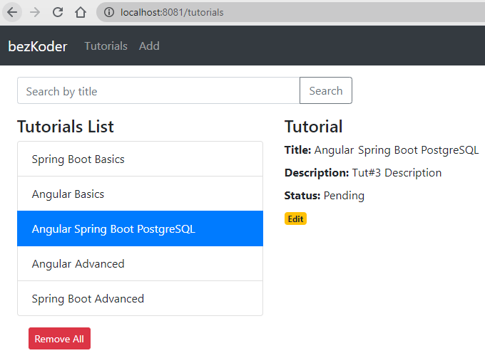

# Spring Boot + Angular 17 + PostgreSQL CRUD example

Full-stack Angular 17 + Spring Boot + PostgreSQL CRUD Tutorial Application in that:
- Each Tutorial has id, title, description, published status.
- We can create, retrieve, update, delete Tutorials.
- We can also find Tutorials by title.



For more detail, please visit:
> [Spring Boot + Angular 17 + PostgreSQL: CRUD example](https://www.bezkoder.com/spring-boot-angular-17-postgresql/)

Run both Back-end & Front-end in one place:
> [Integrate Angular with Spring Boot Rest API](https://www.bezkoder.com/integrate-angular-spring-boot/)

More Practice:
> [Angular 17 + Spring Boot: File upload example](https://www.bezkoder.com/angular-17-spring-boot-file-upload/)

> [Angular 17 + Spring Boot: JWT Authentication and Authorization example](https://www.bezkoder.com/angular-17-spring-boot-jwt-auth/)

## Run Spring Boot application
```
mvn spring-boot:run
```
The Spring Boot Server will export API at port `8081`.

## Run Angular Client
```
npm install
ng serve --port 8081
```
